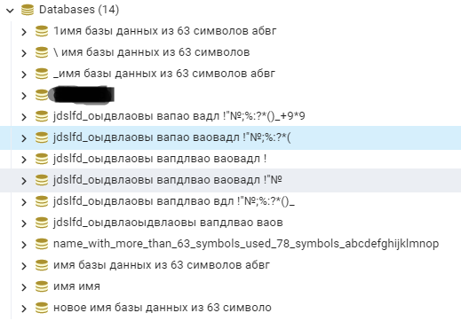

## Задание 1. Процесс тестирования нового функционала

<details>
<summary>Формулировка задания под спойлером</summary>

В Облачном сервисе хранения и обработки информации в базах данных появилась новая функциональность: можно развернуть базу данных PostgreSQL, заполнив форму в веб-интерфейсе и кликнув на кнопку создать. Обязательные поля: имя базы данных, регион размещения, размер.
Необходимо разработать стратегию тестирования нового функционала.
Технические требования: ответ может быть представлен в свободной форме;
на каждый вид тестирования по 2-5 кейсов.
</details>

### Вопросы к требованиям
 - Есть ли ограничения на имя базы данных при создании через форму: язык, пробелы, спецсимволы, иероглифы?
Проводится ли проверка на стороне фронта/бэка? Или действуют только ограничения системы управления БД?
 - Есть ли функционал создания базы при отправке пустого поля (имя базы) по имени пользователя (имя базы = имя пользователя)?
 - Какие требования к окружению на котором необходимо обеспечить полный функционал: операционные системы; браузеры: Chrome, Safari, Firefox?
 - Как реализованы поля/селекторы для Региона и Размера БД? Список с фиксированными значениями?
 - Какие версии postgres доступны?


Так как требования неполные, далее приведен пример стратегии тестирования версии postgresql 15 при описанных ниже условиях.

#### Имена
В соответствии с требованиями [документации](https://www.postgresql.org/docs/15/tutorial-createdb.html) postgresql 
имена баз данных должны начинаться с буквы и максимальная длина имени 63 байта. Но это не так в части начала с буквы, под спойлером скриншот имен баз, созданных
в postgresql 15. Имена могут начинаться с символов, пробела или цифр, но не могут содержать только пробел и по умолчанию не создаются по пустому полю.
<details><summary>Скриншот</summary>


</details>


Пустое поле имени отностися либо к позитивным, либо к негативным проверкам, в зависимости от настроек клиента: 
- если клиент поддерживает функцию создания имени базы из имени юзера, то к позитивным (в данном примере ниже);
- если не поддерживает, то к негативным.


#### Регионы размещения
Для примера используются три условных региона. В данном примере подразумевается, что список регионов - это html select с фиксированными значениями

#### Размер базы
Для примера используются пять условных размеров баз данных. В данном примере подразумевается, что список доступных размеров - это html select с фиксированными значениями

### Тестовая документация
<sub>null - в чек-листах обозначает пустое поле</sub>  
<sub>space - обозначает пробел</sub>

Чек-лист Pairwise - позитивные проверки

| # | Имя базы                                                        | Регион размещения | Размер | Браузер |
| --- |-----------------------------------------------------------------| --- | --- | --- |
| 1 | simplenamedb                                                    | region 2 | 30 |  Chrome |
| 2 | simplenamedb                                                    | region 3 | 40 | Safari |
| 3 | simplenamedb                                                    | region 1 | 50 | Firefox |
| 4 | simplenamedb                                                    | region 3 | 10 | Safari |
| 5 | simplenamedb                                                    | region 1 | 20 | Firefox |
| 6 | n                                                               | region 3 | 50 |  Chrome | 
| 7 | n                                                               | region 2 | 10 | Firefox | 
| 8 | n                                                               | region 3 | 20 |  Chrome | 
| 9 | n                                                               | region 1 | 30 | Safari | 
| 10 | n                                                               | region 2 | 40 | Firefox | 
| 11 | null                                                            | region 1 | 10 |  Chrome | 
| 12 | null                                                            | region 2 | 20 | Safari | 
| 13 | null                                                            | region 3 | 30 | Firefox | 
| 14 | null                                                            | region 1 | 40 |  Chrome | 
| 15 | null                                                            | region 2 | 50 | Safari | 
| 16 | normal_name_with_63_symbols_max abcdefghijklmnopqrstuvwxyz12345 | region 2 | 30 |  Chrome | 
| 17 | normal_name_with_63_symbols_max abcdefghijklmnopqrstuvwxyz12345 | region 3 | 40 | Safari | 
| 18 | normal_name_with_63_symbols_max abcdefghijklmnopqrstuvwxyz12345 | region 1 | 50 | Firefox | 
| 19 | normal_name_with_63_symbols_max abcdefghijklmnopqrstuvwxyz12345 | region 2 | 10 |  Chrome | 
| 20 | normal_name_with_63_symbols_max abcdefghijklmnopqrstuvwxyz12345 | region 3 | 10 | Safari | 
| 21 | normal_name_with_63_symbols_max abcdefghijklmnopqrstuvwxyz12345 | region 1 | 20 | Firefox | 
| 22 | simplenamedb                                                    | region 3 | 50 |  Chrome | 
| 23 | simplenamedb                                                    | region 1 | 10 | Safari | 
| 24 | simplenamedb                                                    | region 2 | 10 | Firefox | 
| 25 | simplenamedb                                                    | region 3 | 20 |  Chrome | 
| 26 | simplenamedb                                                    | region 1 | 30 | Safari | 
| 27 | simplenamedb                                                    | region 2 | 40 | Firefox |


Чек-лист Pairwise - негативные проверки

| #  | Имя базы                                        | Регион размещения | Размер | Браузер |
|----|-------------------------------------------------|-------------------|--------|---------|
| 1  | имя базы данных больше 63 байт !”№ %:?*(()))-=+ | region 3          | 30     | Firefox |
| 2  | space                                           | region 2          | 30     | Chrome  |
| 3  | space                                           | region 3          | 40     | Safari  |
| 4  | space                                           | region 1          | 50     | Chrome  |
| 5  | space                                           | region 2          | 10     | Safari  |
| 6  | space                                           | region 1          | 20     | Firefox |
| 7  | имя базы данных больше 63 байт !”№ %:?*(()))-=+ | region 3          | 50     | Safari  |
| 8  | имя базы данных больше 63 байт !”№ %:?*(()))-=+ | region 1          | 10     | Firefox |
| 9  | имя базы данных больше 63 байт !”№ %:?*(()))-=+ | region 2          | 20     | Chrome  |
| 10 | имя базы данных больше 63 байт !”№ %:?*(()))-=+ | region 1          | 30     | Safari  |
| 11 | имя базы данных больше 63 байт !”№ %:?*(()))-=+ | region 2          | 40     | Chrome  |
| 12 | space                                           | region 1          | 20     | Safari  |
| 13 | space                                           | region 1          | 40     | Safari  |
| 14 | space                                           | region 2          | 50     | Firefox |
| 15 | space                                           | region 3          | 10     | Chrome  |
| 16 | имя базы данных больше 63 байт !”№ %:?*(()))-=+ | region 2          | 40     | Firefox |
| 17 | имя базы данных больше 63 байт !”№ %:?*(()))-=+ | region 1          | 50     | Chrome  |
| 18 | имя базы данных больше 63 байт !”№ %:?*(()))-=+ | region 2          | 10     | Safari  |
| 19 | имя базы данных больше 63 байт !”№ %:?*(()))-=+ | region 3          | 20     | Chrome  |


### Пример тест-кейса

#### Создать базу данных с допустимым именем, регионом и размером
**Бизнес-требования:** [Link](https://github.com/QACloudCamp/test-assignment/blob/main/README.md)

**Автор:** Виктор

**Окружение:** Windows 10 22H2; Chrome 114.0

**Тестовые данные:**
 - Имя базы данных: simplenamedb
 - Регион: region 2
 - Размер: 30

**Предусловия:** Авторизация выполнена, страница с формой открыта

**Шаги**
1. Заполнить поле "Имя"
2. Выбрать регион
3. Выбрать размер БД
4. Нажать кнопку "Создать"

**Ожидаемый результат:** База данных создана, на экран выведено сообщение об успешном
создании базы, либо осуществлен автоматический переход в панель управления вновь созданной базы данных

**Постусловие:** удалить тестовую базу данных

**Тест выполнен**

| Дата       | Время | Результат | Имя | Баг № Trello |
|------------| --- | --- | --- | --- |
| 2023-06-14 | 9:00 | Faild | Виктор | 0001 |

## Задание 2. Автоматизация тестирования API. Часть 1
<details>
<summary>Формулировка задания под спойлером</summary>

Необходимо подготовить проект с автотестами, которые будут проверять работу всех API-эндпоинтов, описанных ниже.  
Технические требования:  
<sub>API url https://jsonplaceholder.typicode.com/  
Методы, требующие проверки: GET /posts, POST /posts, DELETE /posts   
Методы могут принимать параметры userId, id, title, body  
В качестве языка программирования используйте python  
Добавьте в README инструкцию по поднятию проекта  
Используйте библиотеку requests, а также pytest</sub>
</details>

### Инструкция по поднятию проекта на локальной машине
Сделать Fork проекта, загрузить проект на локальную машину. Установить Python 3.11.4 и зависимости из requirements.txt.
Запустить тесты из директории с проектом командой ```python -m pytest```.

## Задание 2. Автоматизация тестирования API. Часть 2
<details>
<summary>Формулировка задания под спойлером</summary>
<sub>Напишите Dockerfile к своему приложению по проверке API-методов из части 1.
Технические требования:
добавьте команду запуска в README.</sub>
</details>

### Инструкция по запуску тестов в докер-контейнере
 Перейти в директорию с проектом и собрать образ,
выполнив команду ниже
```
docker build -t pytest_runner .
```

Запустить контейнер с тестами

```
docker run --name pytest-runner pytest_runner
```